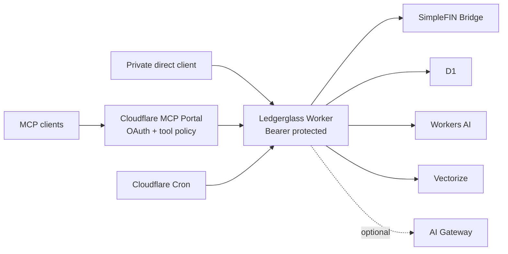

# Ledgerglass Starter

[](https://github.com/JithendraNara/ledgerglass-starter/actions/workflows/ci.yml)
[](https://developers.cloudflare.com/workers/)
[](https://modelcontextprotocol.io/)
[](LICENSE)

An independent, deploy-your-own personal-finance MCP starter built on
[SimpleFIN Bridge](https://beta-bridge.simplefin.org/). It is not an official
SimpleFIN product and does not use SimpleFIN branding.

The public repository contains source code and synthetic examples only: no
credentials, account inventory, financial rows, Cloudflare resource IDs,
private endpoints, statement files, or production history.

## Capabilities

- Stateless Streamable HTTP MCP endpoint at `/mcp`
- Cloudflare MCP Portal for client OAuth, tool policy, and centralized discovery
- Separate read and owner bearer credentials at the private Worker origin
- Daily SimpleFIN synchronization with five-day overlap and bounded request windows
- D1 account, transaction, coverage, correction, evaluation, and audit records
- Currency-separated balance and cashflow summaries
- Workers AI categorization with deterministic guardrails and explicit fallback telemetry
- Vectorize semantic search with SQL correctness filters
- MCP prompts for a finance checkup and transaction investigation
- Safe `/health` and `/ready` endpoints without financial details

This is a compact starter, not a public mirror of any private deployment. It
does not claim statement reconciliation, immutable ledger-v2 provenance,
pending-transaction lifecycle automation, or an autonomous finance steward.
Those features need their own migrations, tests, and privacy review before they
belong in a reusable template.

## Architecture



The Worker intentionally does not implement its own OAuth server or dynamic
client registration. Cloudflare MCP Portal is the public client boundary. The
origin accepts bearer credentials and should be known only to the portal and
explicitly configured private clients.

## Financial Semantics

- Human `endDate` values are inclusive; the SimpleFIN API receives the next
  midnight as its exclusive bound.
- Syncs use five days of overlap and split longer reads into bounded windows.
- SimpleFIN responses and error text are size-bounded and sanitized.
- Multi-currency values are returned under `by_currency`; unlike currencies
  are never added into one total.
- AI output never becomes trustworthy merely because a model answered. Tools
  expose model, fallback, parse, confidence, coverage, and freshness evidence.
- Workers Logs remain disabled by default. The application stores bounded
  operational metadata without prompts, arguments, financial payloads, or
  authorization values.

## MCP Surface

Start with `agent_guidance`, `worker_operational_status`,
`simplefin_data_coverage`, and `finance_overview`.

Read tools cover accounts, transactions, cashflow, merchants, recurring
obligations, semantic search, anomaly evidence, briefings, corrections, and
evaluation history. Owner tools cover sync, setup-token claiming,
categorization, corrections, eval labels/runs, sanitized audit events, and
insight refresh. The live server inventory is authoritative.

Prompts:

- `finance_checkup`
- `investigate_transaction`

## Quick Start

```bash
npm ci
npm run check
```

Then follow [docs/SETUP.md](docs/SETUP.md). It covers D1, KV, Vectorize,
secrets, deployment, and Cloudflare MCP Portal registration.

Useful files:

- [Cloudflare MCP Portal example](examples/cloudflare-mcp-portal.example.md)
- [direct bearer client](configs/cloudflare-worker-mcp.example.json)
- [finance-agent workflow](docs/FINANCE_AGENT_WORKFLOW.md)
- [reusable design patterns](docs/PATTERNS.md)
- [security policy](SECURITY.md)

## SimpleFIN Operating Limits

The current SimpleFIN developer guide allows at most 24 requests per day and a
maximum 90-day request range. The default cron makes ordinary refreshes once a
day, adds a five-day overlap for late settlement, and uses shorter request
windows for backfills. Check the upstream guide before changing sync behavior.

## Public-Repository Boundary

`npm run privacy:audit` fails on tracked statement files, databases, private
workspace paths, the known private production hostname, and common embedded
credential forms. CI also runs dependency audit, both TypeScript builds, tests,
and a Wrangler dry-run. CI never deploys this template and holds no Cloudflare
or SimpleFIN secret.

Before publishing a fork:

```bash
npm run privacy:audit
git status --short
```

Keep real configuration and operational evidence in a private deployment
repository or Cloudflare itself.

## Documentation

- [Setup](docs/SETUP.md)
- [Finance Agent Workflow](docs/FINANCE_AGENT_WORKFLOW.md)
- [Reusable MCP Patterns](docs/PATTERNS.md)
- [2026 public starter audit](docs/AUDIT-2026-08-12.md)
- [Contributing](CONTRIBUTING.md)
- [Security](SECURITY.md)
